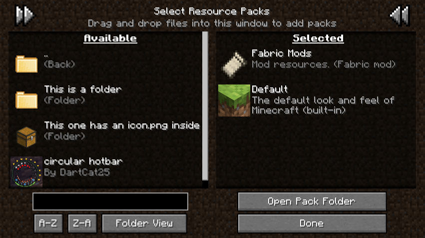

# Recursive Resources - Forge 

## Features

Recursive Resources is a mod that revamps the vanilla resource pack menu to be more user-friendly with the addition of many Quality of Life features, such as:

- Organize resource packs into folders that you can navigate from within the game
- Give these folders custom icons by placing an image named `icon.png` inside them
- Enable full folders of resource packs at once, effectively creating "profiles"
- Choose between folder view (navigate in and out of folders) and flat view (packs from all folders shown in a single list)
- Search pack names and description (supports the `*` wildcard)
- Sort packs and folders alphabetically from A-Z or Z-A

## Screenshots

## License

This mod is under the [Mozilla Public License](LICENSE), version 2.0
